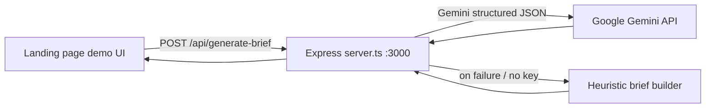

# FounderBrief — Landing Page Demo Handoff

> **Paste this entire document into your landing-page codebase agent.**  
> Goal: wire up a **free one-time working demo** on the marketing landing page using the same backend + flow that already works in the FounderBrief app repo.

---

## 1. Mission

Build a **live demo** on the landing page that lets a visitor:

1. Describe a startup idea (text, optional voice on web)
2. Answer 5 short questionnaire steps (or skip with defaults)
3. Receive a **real AI-generated technical brief** (title, budget, features, user stories, dev questions)
4. Be limited to **one free demo per browser** — after that, show upgrade / sign-up CTA

The demo must call the **same API** as the working app. Do not mock the result.

**Working reference repo:** `https://github.com/Sabih-sourcee/founderbreif`  
**Local path (if cloned):** project root = Express + Vite React app; `mobile/` = Expo app (optional, not required for landing demo).

---

## 2. Architecture (what makes it work)



- **Single server** (`server.ts`) serves both the Vite SPA and API routes in dev.
- **Production:** `npm run build` then `npm start` — Express serves `dist/` + same API routes.
- **Gemini key stays server-side only** — never expose `GEMINI_API_KEY` in the landing page client.
- **Resilient:** if Gemini fails or key is missing, server returns a high-quality heuristic brief (user still gets a result).

---

## 3. Backend — copy or proxy this

### 3.1 Required npm dependencies (server)

```json
{
  "@google/genai": "^2.4.0",
  "dotenv": "^17.2.3",
  "express": "^4.21.2",
  "multer": "^1.4.5-lts.1"
}
```

Dev also uses: `tsx`, `vite`, `@vitejs/plugin-react` (only if bundling frontend with same server).

### 3.2 Environment variables (project root `.env`)

```env
# Create at https://aistudio.google.com/apikey
# New AI Studio keys use AQ. prefix — that is normal and valid.
GEMINI_API_KEY=your_key_here

APP_URL=http://localhost:3000
```

Restart server after changing `.env`.

### 3.3 CORS (required if landing page is on a different origin)

The working server already has:

```js
app.use((req, res, next) => {
  res.header("Access-Control-Allow-Origin", "*");
  res.header("Access-Control-Allow-Methods", "GET, POST, OPTIONS");
  res.header("Access-Control-Allow-Headers", "Content-Type");
  if (req.method === "OPTIONS") return res.sendStatus(204);
  next();
});
```

If landing page is deployed separately (e.g. Vercel), either:
- **Option A:** Deploy `server.ts` as API (Railway, Render, Fly.io) and set `NEXT_PUBLIC_API_URL` / `VITE_API_URL` on landing page, **or**
- **Option B:** Add a thin proxy route on the landing host that forwards to the FounderBrief API.

### 3.4 API endpoints

#### `GET /api/health`

**Response:**
```json
{ "status": "ok" }
```

Use on page load to show/hide “backend offline” banner.

---

#### `POST /api/generate-brief` ← **main demo endpoint**

**Request body:**
```json
{
  "idea": "A laundry delivery app in Karachi with rider tracking and online payments",
  "answers": {
    "platform": "Both",
    "platformDetails": "",
    "auth": "Email & Password",
    "authDetails": "",
    "integrations": "Payments",
    "integrationsDetails": "",
    "design": "Modern Minimalism",
    "designDetails": "",
    "timeline": "Full Release (3-6 months)",
    "timelineDetails": ""
  }
}
```

**`answers` field reference:**

| Field | Allowed values (defaults in parentheses) |
|-------|------------------------------------------|
| `platform` | `"Android"` \| `"iPhone"` \| `"Both"` (`"Both"`) |
| `platformDetails` | free text |
| `auth` | `"Email & Password"` \| `"Social Accounts"` \| `"No authentication"` |
| `authDetails` | free text |
| `integrations` | `"Payments"` \| `"Maps & Location"` \| `"AI or Messaging"` |
| `integrationsDetails` | free text |
| `design` | `"Modern Minimalism"` \| `"Bold & Colorful"` \| `"Classic Corporate"` |
| `designDetails` | free text |
| `timeline` | `"Sprints MVP (1-2 months)"` \| `"Full Release (3-6 months)"` \| `"Enterprise Scale (6+ months)"` |
| `timelineDetails` | free text |

**Success response (200):**
```json
{
  "title": "Karachi Laundry Express Spec",
  "description": "A one-sentence professional summary of the system.",
  "complexity": "Medium",
  "estimatedBudget": "$12,000 - $18,000",
  "coreFeatures": [
    "Feature 1 - description",
    "Feature 2 - description",
    "Feature 3 - description",
    "Feature 4 - description"
  ],
  "userStories": [
    "As a customer, I want to ... so that ...",
    "As a rider, I want to ... so that ...",
    "As an admin, I want to ... so that ..."
  ],
  "devQuestions": [
    "Technical vetting question 1?",
    "Technical vetting question 2?",
    "Technical vetting question 3?"
  ]
}
```

**Errors:**
- `400` — `{ "error": "Product idea is required." }`
- Gemini errors are **not** surfaced to user — server falls back to heuristic brief and still returns `200`.

**Client fetch example (landing page):**
```ts
const API_BASE = import.meta.env.VITE_API_URL ?? ""; // empty = same origin

async function generateBrief(idea: string, answers: BriefAnswers) {
  const res = await fetch(`${API_BASE}/api/generate-brief`, {
    method: "POST",
    headers: { "Content-Type": "application/json" },
    body: JSON.stringify({ idea, answers }),
  });
  const data = await res.json();
  if (!res.ok) throw new Error(data.error ?? "Generation failed");
  return data;
}
```

---

#### `POST /api/transcribe-voice` (optional — mobile uses this; web uses browser Speech API)

Multipart form field: `audio` (max 15MB). Returns `{ "text": "..." }`.  
Only needed if landing demo wants server-side transcription; web app uses `webkitSpeechRecognition` instead.

---

### 3.5 Gemini configuration (inside `server.ts`)

- SDK: `@google/genai` → `new GoogleGenAI({ apiKey: process.env.GEMINI_API_KEY })`
- Model for brief: `gemini-3.5-flash`
- Model for voice: `gemini-2.5-flash`
- Structured output via `responseMimeType: "application/json"` + `responseSchema` (see full `server.ts` in repo)
- System instruction: elite CTO tone, no marketing fluff
- **Fallback function:** `buildHeuristicBrief(idea, answers)` — always available when Gemini fails

---

## 4. Demo user flow (implement on landing page)

```
Landing hero
  → [Try free demo] CTA
  → Step 1: Describe idea (textarea, max 500 chars, example prompt clickable)
  → Step 2: 5-question wizard (platform, auth, integrations, design, timeline)
       OR "Skip questionnaire" → uses defaults above
  → Loading overlay (~5–8s with rotating status messages)
  → Result card: title, description, complexity badge, budget, 4 features, 3 stories, 3 dev questions
  → Actions: Copy to clipboard, Share (optional), [Sign up for unlimited briefs]
```

**Loading step messages (copy from working app):**
1. "Translating startup vision into functional features..."
2. "Analyzing technical complexity hurdles..."
3. "Constructing investor-ready user story personas..."
4. "Forging CTO-level vetting questions..."
5. "Assembling estimated USD developer budget maps..."

Rotate every ~1.5s while `POST /api/generate-brief` is in flight.

---

## 5. Free one-time demo limit

Implement on the **client** (landing page):

```ts
const DEMO_KEY = "founderbrief_demo_used";

function hasUsedFreeDemo(): boolean {
  return localStorage.getItem(DEMO_KEY) === "1";
}

function markDemoUsed(): void {
  localStorage.setItem(DEMO_KEY, "1");
}

// Call markDemoUsed() only after successful brief generation
```

**UX when limit hit:**
- Hide/disable demo form
- Show: “You’ve used your free demo. Create an account for unlimited briefs.”
- Link to app signup / app store / full product URL

Optional server-side hardening (recommended for production):
- Rate limit by IP on `/api/generate-brief` (e.g. 1 req / 24h for unauthenticated demo)
- Require API key or session for repeat calls

---

## 6. TypeScript types (copy as-is)

```ts
export interface BriefAnswers {
  platform: "Android" | "iPhone" | "Both";
  platformDetails: string;
  auth: string;
  authDetails: string;
  integrations: string;
  integrationsDetails: string;
  design: string;
  designDetails: string;
  timeline: string;
  timelineDetails: string;
}

export interface ProjectBrief {
  id: string;
  title: string;
  description: string;
  complexity: "Low" | "Medium" | "High";
  estimatedBudget: string;
  coreFeatures: string[];
  userStories: string[];
  devQuestions: string[];
  createdAt: string;
  originalIdea: string;
  answers: BriefAnswers;
}
```

After API response, wrap with:
```ts
const brief: ProjectBrief = {
  id: `demo-${Date.now()}`,
  ...apiResponse,
  createdAt: new Date().toISOString(),
  originalIdea: idea,
  answers: finalAnswers,
};
```

---

## 7. Questionnaire config (5 steps — copy logic from `src/components/QuestionsScreen.tsx`)

| # | Title | Field | Options |
|---|-------|-------|---------|
| 1 | Launch Platform | `platform` | Android Only, iPhone Only, Cross-Platform (Both) |
| 2 | User Management | `auth` | Email/Pass, Social OAuth, No Auth Needed |
| 3 | Key Integrations | `integrations` | Payments, Map/Routes API, Custom GenAI |
| 4 | Visual Theme | `design` | Sleek Minimal, Vibrant/Graphic, Classic/Clean |
| 5 | Target Timeline | `timeline` | MVP 1–2 mo, Core 3–6 mo, Scale 6+ mo |

Each step has an optional free-text detail field (`platformDetails`, `authDetails`, etc.).

---

## 8. UI / brand tokens (match working app)

| Token | Value |
|-------|-------|
| Background | `#FAF8F5` |
| Primary text | `#1A1A1A` |
| Muted text | `#444748` |
| Accent / CTA orange | `#E07B39` |
| Card surface | `#F2EEE8` |
| Border | `#E5DDD3` |
| Primary button | `#1A1A1A` bg, `#FAF8F5` text |
| Generate button | `#E07B39` bg |

Typography: clean sans-serif; labels often uppercase mono at 10–11px.

**Example starter templates (click-to-fill on landing):**
- On-Demand Delivery App — laundry/grocery delivery with rider tracking + payments
- B2B SaaS Inventory Tracker — multi-warehouse stock + auto-replenishment
- Interactive AI Classroom Helper — GenAI homework companion by grade level

---

## 9. Files to reference or port from working repo

| File | Purpose |
|------|---------|
| `server.ts` | **Entire backend** — API routes, Gemini prompt, fallback, CORS, Vite middleware |
| `src/types.ts` | Shared interfaces |
| `src/App.tsx` | Flow orchestration, loading overlay, `fetch("/api/generate-brief")` call |
| `src/components/DescribeIdeaScreen.tsx` | Idea input + web mic (SpeechRecognition) |
| `src/components/QuestionsScreen.tsx` | 5-step questionnaire + defaults |
| `src/components/BriefResultScreen.tsx` | Result layout, copy-to-clipboard, print/PDF |
| `src/components/LandingScreen.tsx` | Hero, metrics, templates, CTAs |
| `.env.example` | Env template |
| `package.json` | Scripts: `dev` = `tsx server.ts`, `build`, `start` |

**Minimal landing demo scope:** port types + 3 screens (idea, questions, result) + one API client module. Skip history, profile, bottom nav unless needed.

---

## 10. How to run locally (verify before integrating)

```powershell
# Terminal 1 — project root
cd founderbrief
copy .env.example .env
# Edit .env → paste GEMINI_API_KEY from aistudio.google.com/apikey
npm install
npm run dev
# → FounderBrief server on http://localhost:3000

# Terminal 2 — if testing mobile (not required for landing)
cd mobile
copy .env.example .env
# Set EXPO_PUBLIC_API_URL=http://YOUR_PC_LAN_IP:3000 for physical device
npm install
npm run start -- --clear
```

Health check: `curl http://localhost:3000/api/health` → `{"status":"ok"}`

---

## 11. Production deployment checklist

- [ ] Deploy `server.ts` with `GEMINI_API_KEY` as secret env var
- [ ] Set landing page `VITE_API_URL` / `NEXT_PUBLIC_API_URL` to deployed API origin
- [ ] Ensure CORS allows landing origin (replace `*` with specific domain in prod)
- [ ] Add rate limiting on `/api/generate-brief` for anonymous demo
- [ ] Never commit `.env` or expose Gemini key in client bundle
- [ ] Test one full demo flow end-to-end after deploy

---

## 12. Known gotchas (already solved in working repo)

| Issue | Fix |
|-------|-----|
| Mobile can't reach `localhost` | Use PC LAN IP in `EXPO_PUBLIC_API_URL`, same Wi‑Fi, allow port 3000 in firewall |
| `injected env (0)` | Create root `.env` with `GEMINI_API_KEY` |
| Gemini 403 on old keys | Regenerate key in AI Studio if marked **Blocked**; `AQ.` prefix is valid |
| No API key | Server still returns heuristic brief — demo works but less personalized |
| Expo Hermes/babel errors | See `mobile/metro.config.js` + `babel.config.js` (mobile only) |

---

## 13. Agent implementation checklist

Copy this checklist for the landing-page agent:

- [ ] Add API client module with `generateBrief()` + `checkHealth()`
- [ ] Add demo modal or `/demo` route with 3-step flow
- [ ] Implement `localStorage` one-time demo gate
- [ ] Match brand colors and loading overlay
- [ ] Wire `POST /api/generate-brief` to deployed or local API
- [ ] Render full brief result (title, budget, complexity, 4+3+3 lists)
- [ ] Post-demo CTA: sign up / download app / pricing
- [ ] Test with real Gemini key — confirm JSON response parses correctly
- [ ] Test with Gemini disabled — confirm fallback still shows result
- [ ] Test second demo attempt — confirm paywall / signup message

---

## 14. Example cURL (smoke test)

```bash
curl -X POST http://localhost:3000/api/generate-brief \
  -H "Content-Type: application/json" \
  -d "{\"idea\":\"A pet-sitting marketplace for busy professionals\",\"answers\":{\"platform\":\"Both\",\"platformDetails\":\"\",\"auth\":\"Social Accounts\",\"authDetails\":\"\",\"integrations\":\"Payments\",\"integrationsDetails\":\"Stripe\",\"design\":\"Modern Minimalism\",\"designDetails\":\"\",\"timeline\":\"Sprints MVP (1-2 months)\",\"timelineDetails\":\"\"}}"
```

Expected: JSON with `title`, `description`, `complexity`, `estimatedBudget`, `coreFeatures` (4), `userStories` (3), `devQuestions` (3).

---

*End of handoff — paste everything above into the landing page agent prompt.*
